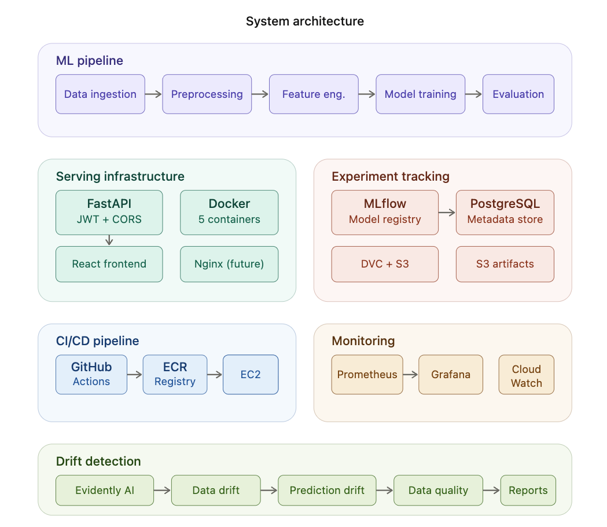

# Emotion Detection — End-to-End MLOps Pipeline

A production-grade MLOps project demonstrating the complete lifecycle of a machine learning system: from data ingestion to model deployment, monitoring, and drift detection. Built with real-world engineering practices used at companies like DeepL, Realtor.com, and Netflix.

> **Note:** This project focuses on **MLOps infrastructure**, not model performance. The ML model (XGBoost + Bag of Words) is intentionally simple to keep the focus on the engineering pipeline. See [Future Improvements](#future-improvements) for model enhancement plans.

---

## Architecture



---

## What This Project Demonstrates

| Skill | Implementation | Why It Matters |
|-------|---------------|----------------|
| **Data Pipeline** | DVC-managed 5-stage pipeline with S3 storage | Reproducible experiments, version-controlled data |
| **Experiment Tracking** | MLflow with PostgreSQL backend and S3 artifacts | Compare models, track metrics, registry workflow |
| **Model Serving** | FastAPI with JWT auth, CORS, request logging | Production-ready API with security and observability |
| **Containerization** | Docker Compose with 5 services | One command to run the entire stack |
| **CI/CD** | GitHub Actions: test → build → deploy (dev + prod) | Automated quality gates, zero-touch deployment |
| **Infrastructure** | Two EC2 environments, ECR registry, S3 storage | Real AWS deployment, not just localhost |
| **Monitoring** | Prometheus metrics + Grafana dashboard + CloudWatch | Real-time visibility into API and model health |
| **Drift Detection** | Evidently AI with 5 simulated production scenarios | Proactive model quality monitoring |
| **Frontend** | React app with dark theme, demo credentials | Demo-able in 30 seconds by any recruiter |

---

## Tech Stack

**ML & Data:** Python 3.10, XGBoost, scikit-learn, DVC, MLflow, Evidently AI

**Backend:** FastAPI, Pydantic, PyJWT, Joblib, Uvicorn

**Frontend:** React 18, Vite, DM Sans, JetBrains Mono

**Infrastructure:** Docker, Docker Compose, AWS EC2, S3, ECR

**CI/CD:** GitHub Actions (3 pipelines), automated rollback on production

**Monitoring:** Prometheus, Grafana, AWS CloudWatch, SNS alerts

---

## Project Structure

```
emotion-detection/
│
├── .github/workflows/
│   ├── ci.yaml              # Test + build on every push
│   ├── cd-dev.yaml          # Auto-deploy to dev EC2
│   └── cd-prod.yaml         # Deploy to prod with rollback
│
├── src/
│   ├── data/
│   │   ├── data_ingestion.py
│   │   └── data_preprocessing.py
│   ├── features/
│   │   └── feature_engineering.py
│   ├── models/
│   │   ├── model_building.py
│   │   └── model_evaluation.py
│   ├── api/
│   │   ├── app.py               # FastAPI endpoints
│   │   ├── metrics.py           # Prometheus metrics
│   │   └── middleware/
│   │       ├── auth.py          # JWT authentication
│   │       ├── cors.py          # CORS (environment-aware)
│   │       └── logging_middleware.py
│   ├── monitoring/
│   │   ├── drift_detection.py   # Evidently AI engine
│   │   └── run_experiments.py   # 5 drift scenarios
│   └── utils/
│       └── logger.py            # Centralized logging + S3 upload
│
├── frontend/                    # React app
│   ├── src/
│   │   ├── App.jsx
│   │   ├── App.css
│   │   └── main.jsx
│   ├── package.json
│   └── vite.config.js
│
├── monitoring/
│   ├── prometheus.yml
│   └── grafana/
│       ├── provisioning/
│       │   ├── datasources/datasource.yml
│       │   └── dashboards/dashboard.yml
│       └── dashboards/
│           └── emotion-api.json
│
├── tests/
│   ├── test_smoke.py            # 3 tests
│   ├── test_auth.py             # 11 tests
│   ├── test_security.py         # 15 tests
│   ├── test_middleware.py        # 10 tests
│   ├── test_error.py            # 14 tests
│   └── test_predict.py          # 22 tests
│
├── model/
│   ├── model.joblib             # XGBoost trained model
│   └── vectorizer.joblib        # CountVectorizer (500 features)
│
├── docker-compose.yml           # 5 services
├── Dockerfile                   # Multi-stage build
├── params.yaml                  # Pipeline parameters
├── dvc.yaml                     # Pipeline definition
└── requirements.txt
```

---

## ML Pipeline

The pipeline runs 5 stages managed by DVC, ensuring reproducibility:

```
data_ingestion → data_preprocessing → feature_engineering → model_building → model_evaluation
```

**Data Ingestion:** Downloads and splits data into train/test (80/20).

**Preprocessing:** Lowercasing, URL removal, punctuation removal, number removal, lemmatization. The same preprocessing runs in the API to prevent training-serving skew.

**Feature Engineering:** CountVectorizer (Bag of Words) with 500 features. The vectorizer is saved with joblib and loaded in both training and serving.

**Model Training:** XGBoost classifier. Parameters tracked in MLflow: n_estimators=100, learning_rate=0.1, max_depth=3.

**Evaluation:** Test accuracy, precision, recall, F1 logged to the same MLflow run.

### Experiment History

| Experiment | Method | Model | Result | Decision |
|-----------|--------|-------|--------|----------|
| v1 | BoW (1000) | GradientBoosting | Baseline | Keep as reference |
| v2 | TF-IDF (1000) | GradientBoosting | Worse than baseline | Deleted branch |
| v3 | BoW (500) | XGBoost | Best performance | Merged to main, tagged v2.0 |

---

## API Endpoints

| Endpoint | Method | Auth | Description |
|----------|--------|------|-------------|
| `/health` | GET | Public | Health check for load balancers |
| `/docs` | GET | Public | Swagger UI documentation |
| `/metrics` | GET | Public | Prometheus metrics endpoint |
| `/auth/login` | POST | Public | Get JWT token |
| `/model-info` | GET | Protected | Model version and metadata |
| `/predict` | POST | Protected | Single text prediction |
| `/predict/batch` | POST | Protected | Batch prediction (multiple texts) |

### Middleware Stack (order matters)

```
Request → CORS → Logging → JWT Auth → Endpoint → Response
         (1st)    (2nd)     (3rd)
```

**CORS** handles browser preflight before auth checks. **Logging** records request ID and latency (even for failed auth). **JWT Auth** validates tokens on protected endpoints.

---

## CI/CD Pipeline

Three GitHub Actions workflows automate the entire deployment lifecycle:

### CI Pipeline (`ci.yaml`)
Triggers on every push to any branch and PRs to main.

**Test job** (all branches): flake8 linting → model download from S3 (cached) → pytest (75 tests)

**Build job** (main + dev only): Docker build with layer caching → push to ECR with git-sha and env-latest tags

### CD Dev Pipeline (`cd-dev.yaml`)
Triggers when CI passes on dev branch. SSHs into dev EC2, pulls latest image, health check.

### CD Prod Pipeline (`cd-prod.yaml`)
Triggers when CI passes on main branch. Includes production approval gate (5-minute wait + reviewer required).

**Rollback strategy:** Before deploying, saves the current running image tag. If health check fails (3 attempts with retry), automatically rolls back to the previous version.

```
Save current image → Pull new → Deploy → Health check ──→ Success
                                              │
                                              ▼ (3 failures)
                                         Rollback to saved image
```

### Branch Strategy

```
feature/*  → CI tests only (no deploy)
dev        → CI + build + auto-deploy to dev EC2
main       → CI + build + deploy to prod (approval required)
```

---

## Monitoring

### Prometheus + Grafana

Five custom metrics exposed at `/metrics`:

| Metric | Type | What It Tracks |
|--------|------|---------------|
| `request_count` | Counter | Total requests by method, endpoint, status |
| `request_latency_seconds` | Histogram | Response time with p50, p90, p99 percentiles |
| `prediction_count` | Counter | Predictions by emotion class |
| `prediction_confidence` | Histogram | Model confidence score distribution |
| `model_info` | Info | Model version and type metadata |

**Grafana dashboard** (6 panels, one screen):
- Requests per second (line chart)
- Prediction latency p50 vs p99 (line chart)
- Error rate % (stat with red/yellow/green thresholds)
- Predictions by emotion (donut chart)
- Average confidence score (gauge)
- Total requests today (stat)

### CloudWatch

Four alarms monitoring EC2 infrastructure:
- CPU utilization > 80% for 5 minutes (dev + prod)
- EC2 status check failure (dev + prod)

Budget alert at $8 (80%) and $10 (100%) monthly spend.

### Why Both?

```
Prometheus  → "Is MY APP healthy?" (custom application metrics)
CloudWatch  → "Is AWS healthy?" (infrastructure metrics)
```

Prometheus catches model-level issues (prediction distribution shift, confidence drop). CloudWatch catches infrastructure issues (CPU spike, instance failure).

---

## Drift Detection

Evidently AI detects when production data diverges from training data. Five experiments simulate real production scenarios:

| Experiment | Scenario | Drift Score | Action |
|-----------|----------|-------------|--------|
| 1. Baseline | Normal data (sampled from training) | 0% | None — healthy reference |
| 2. Data drift | Users send short texts (tweets vs reviews) | 62.5% | Test accuracy → retrain if dropped |
| 3. Prediction drift | 90% negative predictions | 12.5% | Check if inputs also changed |
| 4. Data quality | Empty strings, URLs, garbage inputs | 87.5% | Fix data pipeline (don't retrain!) |
| 5. Gradual drift | Text patterns change over 5 weeks | 0% → 62.5% | Auto-retrain when threshold exceeded |

**Key insight:** Drift detection without investigation is useless. Each experiment includes a decision framework:

```
Detect → Investigate root cause → Decide action → Act → Verify
```

Run experiments: `python -m src.monitoring.run_experiments`

HTML reports generated in `reports/drift/` for visual investigation.

---

## Quick Start

### Prerequisites

- Docker Desktop
- Python 3.10
- Node.js 18+
- AWS credentials (for S3 model download)

### Run Locally

```bash
# Clone
git clone https://github.com/Pav-03/dummy_emotion_detection.git
cd dummy_emotion_detection

# Start all services (PostgreSQL + MLflow + FastAPI + Prometheus + Grafana)
docker compose up -d

# Start frontend
cd frontend && npm install && npm run dev

# Open
# Frontend:   http://localhost:3001
# Swagger UI: http://localhost:8000/docs
# Grafana:    http://localhost:3000 (admin/admin)
# Prometheus: http://localhost:9090
# MLflow:     http://localhost:5000
```

### Run ML Pipeline

```bash
source dummy/bin/activate
export $(grep -v '^#' .env | xargs)
dvc repro           # Run full pipeline
dvc push            # Upload data to S3
```

### Run Tests

```bash
pytest tests/ -v --tb=short    # 75 tests
flake8 src/ --max-line-length=125
```

---

## Docker Services

| Service | Container | Port | Purpose |
|---------|-----------|------|---------|
| PostgreSQL | mlflow_postgres | 5432 | MLflow metadata store |
| MLflow | mlflow_server | 5000 | Experiment tracking UI |
| FastAPI | emotion_detection_api | 8000 | Model serving API |
| Prometheus | prometheus | 9090 | Metrics collection |
| Grafana | grafana | 3000 | Monitoring dashboards |

All services start with one command: `docker compose up -d`

---

## AWS Infrastructure

```
Region: eu-west-2 (London)

S3: dummy-emotion-detection-mlops/
├── model/             # Production model files
├── mlflow-artifacts/  # MLflow experiment artifacts
├── dvc-storage/       # DVC data versions
└── logs/              # Application logs

ECR: emotion-api-dev, emotion-api-prod

EC2: emotion-api-dev (t2.medium), emotion-api-prod (t3.micro)

IAM: emotion-api-ec2-role (ECR + S3 access)

CloudWatch: 4 alarms + budget alerts
```

---

## Key Engineering Decisions

**Why joblib over pickle?** scikit-learn officially recommends joblib. Faster serialization for large numpy arrays, smaller compressed files.

**Why JWT over API keys?** Stateless authentication works with multiple server replicas. Auto-expires to limit damage if stolen. Contains user identity for audit trail.

**Why NOT Redis caching?** Model inference is 20-50ms. Adding Redis would be premature optimization that adds complexity without measurable benefit.

**Why CD before monitoring?** For a small team or portfolio project, you need a running system before you can observe it. In a regulated industry (banking, healthcare), monitoring would come first to detect model degradation before automating deployment.

**Why Evidently AI for drift detection?** Open-source, 20M+ downloads, used by DeepL, Realtor.com, and others. Provides statistical tests (KS test, chi-squared) with visual HTML reports. Integrates with Prometheus for automated alerting.

---

## Future Improvements

### Model Performance
The current model (XGBoost + BoW, 500 features) is intentionally simple. Planned improvements:

- Increase `max_features` to 2000-5000 for richer vocabulary
- Experiment with TF-IDF weighting with bigrams/trigrams
- Try transformer-based models (DistilBERT, BERT) for contextual understanding
- Add data augmentation (synonym replacement, back-translation)
- Implement cross-validation for more robust evaluation
- Add multi-class emotion detection (happy, sad, angry, fear, surprise)

### Infrastructure (Production-Ready)
These features are standard in enterprise deployments but out of scope for this portfolio:

- **Application Load Balancer (ALB)** for distributing traffic across multiple instances
- **Auto Scaling Group** to handle traffic spikes automatically
- **Elastic IPs** to prevent IP changes on EC2 restart
- **Separate SSH keys** per environment (dev and prod)
- **AWS Systems Manager** instead of SSH for CD pipelines
- **RDS PostgreSQL** instead of containerized PostgreSQL for MLflow
- **HTTPS with ACM certificates** via ALB
- **Kubernetes (EKS)** for container orchestration at scale
- **Helm charts** for templated deployments
- **Terraform/CloudFormation** for infrastructure as code

### Monitoring Enhancements
- Automated drift detection as a nightly cron job
- Drift scores pushed to Prometheus for Grafana alerting
- Slack/PagerDuty integration for on-call alerting
- Automated retraining pipeline triggered by drift threshold
- A/B testing framework for comparing model versions in production

---

## Test Coverage

75 tests across 6 test files:

| Test File | Tests | Coverage |
|-----------|-------|----------|
| test_smoke.py | 3 | App startup, health check, root endpoint |
| test_auth.py | 11 | JWT creation, validation, expiry, login |
| test_security.py | 15 | Auth bypass attempts, invalid tokens, injection |
| test_middleware.py | 10 | CORS, request logging, request ID |
| test_error.py | 14 | 400, 401, 503 errors, edge cases |
| test_predict.py | 22 | Single predict, batch, empty input, model loading |

---

## About This Project

Built by **Pavan Modi** as a complete MLOps portfolio project, demonstrating the full lifecycle of deploying and monitoring machine learning models in production.

The focus is on **engineering practices** — reproducible pipelines, automated deployment, monitoring, and drift detection — the infrastructure that keeps ML models reliable in the real world.

**GitHub:** [Pav-03/dummy_emotion_detection](https://github.com/Pav-03/dummy_emotion_detection)
